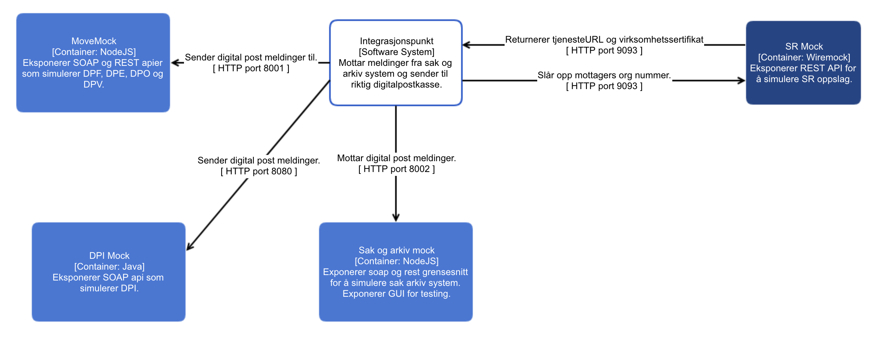

## MoveMocks

MoveMocks lar deg simulere de forskjellige meldingsformidlertjenestene.




### Forutsetninger

* Docker
* Kjørende integrasjonspunkt


### Oppstart

Dersom du skal kjøre DPI mocken må du utføre følgende skritt før docker-compose up:

1. Legge en keystore jks fil i /dpimock/src/main/resources mappen
2. Legge en truststore jks fil i /dpimock/src/main/resources mappen
3. Sette navn på jks filene i dpimmock/src/main/resources/application.properties:
    ```
    keystore.name=altinn.jks
    truststore.name=demo.jks
    ```

4. Bygg dpimock prosjektet: ``` cd /dpimock && ./mvnw install dockerfile:build ```
5. Kjør ``` docker-compose up ``` i roten av prosjektet. 

Du har nå følgende applikasjoner kjørende:

* localhost:8090: Wiremock.
* localhost:8080: DPI mock.
* localhost:8001: DPO, DPV, DPF, og DPE mock.
* localhost:8002: Sak/arkivsystem mock.

På localhost:8001 finner du et lite gui der du kan se meldinger som har blitt sendt vellykket.


### Oppsett

#### Integrasjonspunkt

Integrasjonspunktet må konfigureres til å bruke Wiremock istedenfor SR, og til å bruke mocken for de forskjellige meldingstypene.
Følgende konfigurasjon må settes opp i den gjeldende .properties filen:

Angi urlen til Wiremock(SR) og sak/arkivsystem mocken:
```
difi.move.serviceregistryEndpoint=http://localhost:8090
difi.move.noarkSystem.endpointURL=http://localhost:8002/p360
```

#### Wiremock

Wiremock simulerer Service Registry, og er nødvendig for at Integrasjonspunktet skal kunne slå opp addressen til mottakende meldingsformiddler (som i dette tilfelle er mocken).

I ```Wiremock/__files/identifier```, må det ligge ligge en config fil for organisasjonen man ønsker å sende til, og filen må inneholde nødvendig konfigurasjon for meldingsformiddleren man ønsker å bruke.

Se ```Wiremock/__files/identifier``` for eksempler på alle de støttede meldingstypene.

Se veiledning under for wiremock oppsett for de spesifike meldingstypene.


#### Integrasjonspunkt

Integrasjonspunktet må konfigureres til å bruke Wiremock istedenfor SR, og til å bruke mocken for de forskjellige meldingstypene.
Følgende konfigurasjon må settes opp i den gjeldende .properties filen:

Angi urlen til Wiremock:
```difi.move.serviceregistryEndpoint=http://localhost:8090```

##### DPI

```
difi.move.feature.enableDPI=true
difi.move.dpi.endpoint=http://localhost:8080/as4
difi.move.dpi.trustStore.path=<path til din .jks>/demo.jks
difi.move.dpi.trustStore.password=changeit
```

##### DPV

```
difi.move.feature.enableDPV=true
difi.move.dpv.username=whatever
difi.move.dpv.password=whatever
difi.move.dpv.endpointUrl=http://localhost:8001/dpv/
```

##### DPF
```
difi.move.feature.enableDPF=true
difi.move.fiks.ut.endpointUrl=http://localhost:8001/dpf
difi.move.fiks.inn.baseUrl=http://localhost:8001/svarinn
difi.move.fiks.ut.username=username
difi.move.fiks.ut.password=password
difi.move.fiks.inn.mailOnError=false
```

##### DPO
```
difi.move.feature.enableDPO=true
difi.move.noarkSystem.type=p360
logging.level.no.difi.meldingsutveksling.noarkexchange.altinn=debug
logging.level.org.springframework.ws.client.MessageTracing=TRACE
logging.level.org.springframework.ws.server.MessageTracing=TRACE     
difi.move.noarkSystem.endpointURL=http://localhost:8001/noark
```

##### DPE

```
difi.move.feature.enableDPE=true
difi.move.nextmove.serviceBus.host=local:8001/dpe
```

#### Kjør mocks uten docker

1. MoveMocks krever node.js installert. Gå til [https://nodejs.org/en/download/](https://nodejs.org/en/download/) for å laste ned og installere node js for ditt system.

2. ``` cd mocks && npm i && node index.js```

3. Mocken er nå klar til å ta imot meldinger fra Integrasjonspunktet.

Meldinger som mocken har mottat kan ses på [http://localhost:8001](http://localhost:8001):


#### jMeter

MoveMocks inneholder også jMeter tester. Disse kan brukes til ytelses testing, og for å teste om alt er satt opp og fungerer.
 
1. Åpne en av testene i ```/jMeter ```
2. I test oppsettet i menyen til venstre, gå til ```IP Stress test/Test Oppsett/Sett test variabler```, og angi IP og port til ditt Integrasjonspunkt.
3. Kjør testen.

Dersom alt er satt opp korrekt, vil meldingene gå igjennom, og du vil få et tall på hvor lang tid det tok i terminalen i jMeter. 

